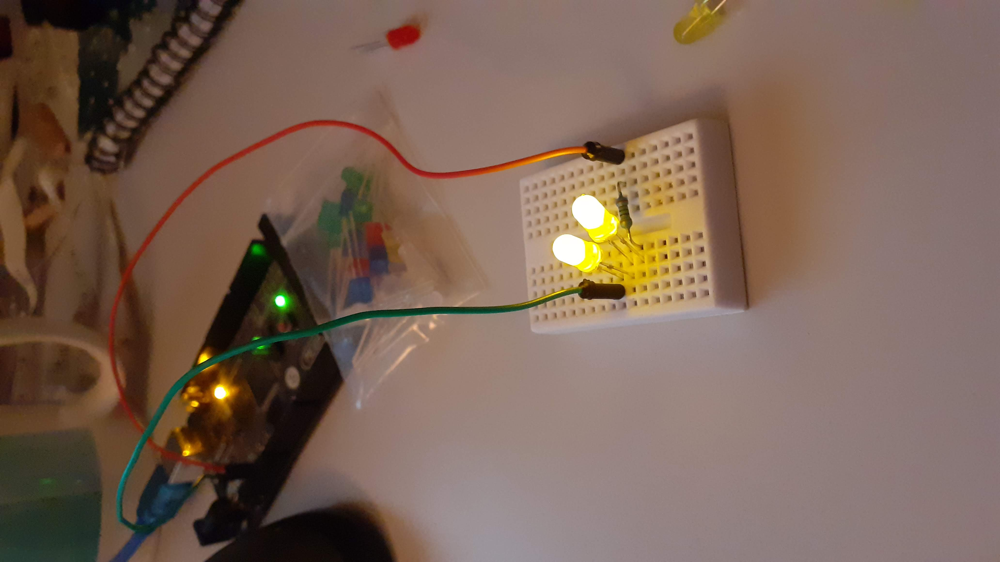
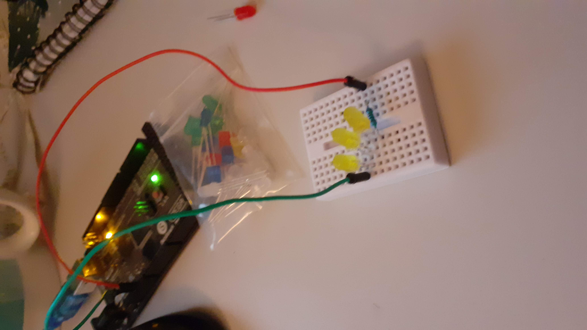
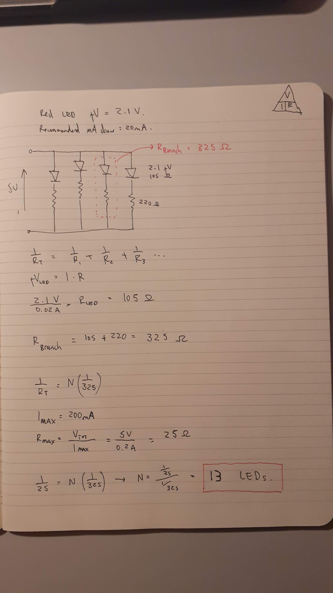
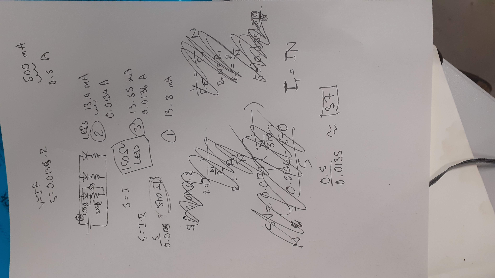

# Week 2

### Lab 00
#### Resistors in Series

I could get 2 LEDs (yellow) to light up in series before the voltage runs out. Instinctively this is what I assumed, which is good, but I struggle to prove it mathematicall. It should be simple... But I couldn't get my head around: if the resistance of the resistor is constant, and the current is also constant, why would the voltage over the resistor change as more LEDs are added to the circuit? I presume the current isn't constant, and the circuit draws more and shares it differently.. I should check this.

Either way, it makes sense, as the ideal forward voltage for an LED is approx 2.2V, and with 5V maximum, there is only enough voltage for 2 LEDs to light up.

#### Resistors in Parallel

This was also a lot tricker that it first appeared... _My_ final maths got me to __13 LEDs__.

But Aleksi got 37 LEDs, which he, Stu and I all thought about for a while together.. And at the time the result did seem to make perfect sense, but he was working with an actual circuit and pulling data and also had a maximum current draw of __500mA__.

### Lab 01

I spent __way__ too much time on this. Serial.read() is actually not a simple thing! Couple with the fact that manipulating char arrays in Arduino Language is also not that simple. I tried to get a simple text adventure style thing working, and it _nearly_ is, but something is not quite right. All the code is in the repo, and here is a video of the next best thing:

### Lab 02

### Lab 03

### Lab 04

